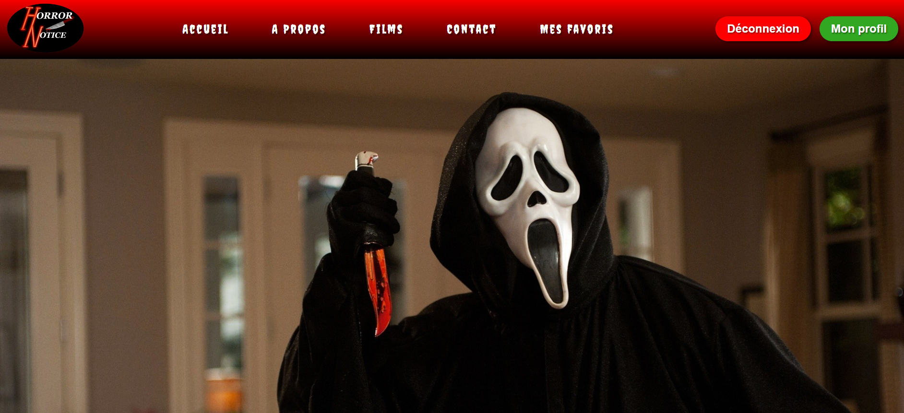

  
  <h1 align="center">Horror Notice</h1>
  
Films d'horreur - Projet Kercode

## Description

Horror Notice est un site dédié aux films d'horreur, destiné aux amateurs de ce genre de films. L'administrateur du site a la possibilité d'ajouter, de modifier et de supprimer des films. Les utilisateurs qui s'inscrivent peuvent regarder les descriptions des films ajoutés et ont également une page de profil où ils peuvent télécharger une photo de profil, modifier leurs informations de compte et supprimer leur compte s'ils le souhaitent. Ils peuvent également ajouter des films à leur liste de favoris et les supprimer de cette liste quand ils le souhaitent.

## Fonctionnalités

- Inscription
- Modification des informations de compte (photo de profil, nom, adresse email, mot de passe)
- Suppression de compte
- Liste de films favoris
- Système de likes

## Langages et Technologies

### Front-End :

- HTML
- CSS
- JavaScript

### Back-End :

- MySQL, MariaDB
- PHP
- Structures MVC
- DotEnv
- Programmation orientée objet

## Installation

Pour installer Horror Notice sur votre ordinateur, vous devez suivre les étapes suivantes :

1. Cloner le repository GitHub en utilisant la commande suivante :

   git clone https://github.com/RomainSebastia/horrorNotice.git

2. À la racine du projet, sur un éditeur de texte ouvrez votre terminal et tapez la commande suivante :

   composer install

   Ceci va installer toutes les dépendances nécessaires pour faire fonctionner le projet.

3. Importez le fichier .sql de la base de données dans votre système de gestion de bases de données.

4. Créez un fichier .env à la racine du projet en copiant le contenu du fichier .env.example et en y entrant les informations de connexion à votre base de données.

## Les améliorations futures

J'avais prévu un système de commentaires entre utilisateurs pour partager leur avis sur les films, mais je n'ai pas eu le temps de le mettre en place faute de temps.

## capture d'ecran de la page d'accueil version desktop 

  </div

